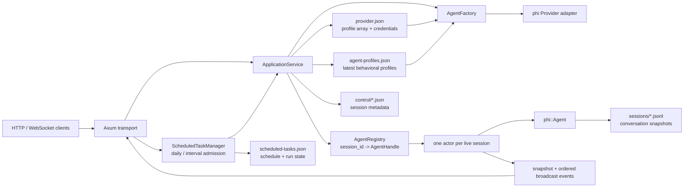

# phi-daemon

`phi-daemon` 把 `phi::Agent` 包装成一个常驻进程：进程内维护 `session_id -> Agent actor` 映射，通过 HTTP 列出已经激活的 session，通过 WebSocket 创建、恢复、操纵 session，并把 Agent 的流式事件广播给所有 attach 的客户端。daemon 还持久化每日/间隔定时任务，在到期时为每次执行创建一个独立 session。

当前实现的重点是 session 生命周期、排队、广播、停止和磁盘恢复。命名 Provider
profile 管理 adapter/凭证/默认生成配置；独立的 Agent Profile 管理 prompt 编译、
工具与 skill 筛选、初始 capability mode，以及可选 model/reasoning override。
每个 daemon 创建的 Agent 都会获得工作区 `read`、`edit`、`write`、`bash` 能力、
交互式 `askuser` 和可配置 subagent 工具；交互 session 还会获得越界工具审批。Skills 默认从全局与工作目录加载；MCP
尚未通过 daemon 配置接入，需要时应提供自定义 `AgentFactory`。

## 架构



关键边界如下：

- 一个 live session 只有一个 actor。actor 串行拥有 `Agent`，因此同一 session 不会并发执行两个 turn。
- `AgentRegistry` 只保存本进程已经激活或 attach 恢复的 session。磁盘上存在、但本进程尚未 attach 的 session 在 HTTP 列表中显示为 `offline`。
- 每个 actor 同时维护一个最新快照和一个有序广播环。多个 WebSocket attach 到同一 actor，会收到相同顺序的 live event。
- Agent 调用 `askuser` 时，actor 保持当前 run 为 `running`，把问题放进快照并广播；任一 attach 客户端都可回答，回答后原 tool future 恢复执行。
- 交互 session 的工具 effect 越过 capability 时，actor 同样持有审批请求并广播；断线不取消，任一 attach 客户端可仅批准本次、记住一个服务端候选规则或拒绝。显式 Agent Profile deny 仍是硬边界。
- `bash(run_in_background=true)` 立即返回 `task_id` 与私有 `output_file`，后台进程完成后通过通用 Agent mailbox 注入 internal `<task_notification>`。通知若赶上 active run，只在下一处协议安全边界合入；若 actor 已 idle，则自动 admission 一个 mailbox-driven run。模型等待通知后用 `read` 读取文件，不需要轮询。
- Agent 调用 `spawn_agent` 时默认等待 child 结果，设置 `run_in_background=true` 才立即返回；创建事件始终先广播给父 session 调用方。后台终态会在父 turn 的下一处协议安全边界进入 mailbox，父 Agent 已 idle 时才排队启动新 turn；progress 只广播、不唤醒。完成的 `general` child 释放 live Agent 后仍可从 durable sidechain transcript 继续。
- Agent Profile 在 prepared Agent 构建时解析，首 prompt 激活时以完整 compiled prompt、
  policy 和 revision pin 入 metadata；之后修改同名 profile 不会改变该 session。
- `ApplicationService` 负责首个 prompt 的延迟激活、持久化 metadata、进程重启后的单飞恢复，以及 registry 生命周期。
- `ScheduledTaskManager` 独立持有调度与运行状态，到期后调用
  `ApplicationService` 创建普通 session；它不绕过 actor 复制 Agent loop。
- 首个 prompt 入队后，daemon 会在独立后台请求中生成 session 标题；标题更新仍回到
  actor 串行持久化并广播，不阻塞或修改主 Agent transcript。
- `phi::SessionStorage` 保存完整 transcript 和 Provider 回放状态；WebSocket 的 public
  history 不暴露 opaque `provider_state`，但会投影规范化的纯文本 `reasoning`。

## 启动

启动 daemon 不需要 Provider 环境变量。未设置 `PHI_DAEMON_AUTH_KEY_FILE` 时，daemon 会
使用 `$HOME/.phi/daemon/auth.key`；目录或 key 尚不存在时，会通过系统安全随机源生成
32 字节随机 key 并持久化，之后启动会复用同一个 key。在 Unix 上自动创建的目录权限为
`0700`，key 文件权限为 `0600`：

```bash
cargo run -p phi-daemon
```

如需使用其他已有 key 文件，可显式设置 `PHI_DAEMON_AUTH_KEY_FILE`。指定路径不存在或 key
无效时 daemon 会拒绝启动，不会覆盖或替换它。

默认以 HTTP/WS 监听 `127.0.0.1:8787`，默认数据目录是相对于启动工作目录的 `.phi/daemon`。
默认 loopback 只适合同机客户端或已经配置 `adb reverse` 的设备。让同一局域网中的手机直接
连接时，显式传入 `--lan`：

```bash
cargo run -p phi-daemon -- --lan
```

`--lan` 保留 `PHI_DAEMON_BIND` 中的端口，但把监听 IP 改为 `0.0.0.0`。这会把 daemon
暴露给本机所有 IPv4 网络接口；必须遵循下文的非本机监听安全要求。
在交互式终端中，daemon 绑定成功后默认显示一个 App 连接二维码；二维码包含实际连接地址和
长期 key，因此应当像 key 文件本身一样保密。二维码载荷是版本化 JSON：

```json
{"type":"phi-daemon","version":1,"base_url":"http://127.0.0.1:8787","auth_key":"<key>"}
```

通过 Cloudflare Tunnel、Tailscale Funnel 或普通反向代理发布 daemon 时，可以显式配置
客户端应使用的公开 base URL：

```bash
PHI_DAEMON_PUBLIC_URL=https://phi.example.com \
  cargo run -p phi-daemon
```

`PHI_DAEMON_PUBLIC_URL` 只覆盖终端显示和二维码载荷中的 `base_url`；它不会修改
`PHI_DAEMON_BIND`、启用 daemon TLS、启动 tunnel，或探测该 URL 是否可达。因此同机
`cloudflared` 可以继续把 loopback HTTP origin `http://127.0.0.1:8787` 发布为公网 HTTPS，
无需使用 `--lan`。该值必须是绝对 `http://` 或 `https://` URL，不能包含用户名、密码、
query 或 fragment；首尾空白和末尾 `/` 会被移除。配置公开 URL 后，二维码不再显示
loopback/LAN 地址提示。

若合法 key 过长、超出单个二维码容量，daemon 只记录不含 key 的 warning 并继续监听。
使用独立二进制时传入 `--no-qr` 可关闭二维码；通过 Cargo 启动时使用
`cargo run -p phi-daemon -- --no-qr`。stderr 不是终端时也不会输出二维码，避免长期 key
随重定向进入服务日志。监听具体地址时二维码使用该地址；使用 `--lan` 或监听 `0.0.0.0`
时，daemon 通过本机路由表优先查找 `10.0.0.0/8`、`172.16.0.0/12` 或
`192.168.0.0/16` 的局域网 IPv4，并保留 listener 的实际端口。找不到私网地址时会从运行中
的网卡选择一个非 loopback IPv4（例如 VPN、CGNAT 或链路本地地址）并在终端提示；仍没有
可用 IPv4 才回退 `127.0.0.1`。自动结果不可达时，应把 `PHI_DAEMON_BIND` 设置为一个确定
可达的地址。使用 TLS 时二维码中的 `base_url` 为 `https://...`，证书也必须对该地址有效，
或由客户端按既有策略显式信任。

同时配置证书与私钥文件后，同一地址改为 HTTPS/WSS；daemon 不会同时开放明文端口。
启动后通过 `PUT /v1/providers/{profile_id}` 写入一个或多个 Provider profile；配置成功前 session 列表仍可使用，但选择未配置 profile 的 `/v1/ws/new` 会返回 `agent_build_failed`。

standalone daemon 将每个父 Agent 和 child Agent 配置为完整 coding agent，并以
`PHI_DAEMON_WORKSPACE_DIR` 作为新 session 的默认 `phi::Workspace`，安装
`read`、`edit`、`write`、`bash`、
`bash_task_output`、`bash_task_stop`。后台 Bash 从启动起将合并输出写入私有临时文件，
目录/文件在 Unix 上分别以 `0700`/`0600` 创建，单文件上限 5 GiB；完成通知由 actor
mailbox 自动唤醒模型，随后用 `read` 读取 `output_file`。`bash_task_output` 属于
deprecated 兼容接口（默认阻塞 30 秒，可设置 `block=false`，最大等待
600 秒），不应被模型用于主动轮询。内建 `default@0` Agent Profile 使用 Phi coding
persona；自定义 profile 可用 `extend` 追加行为说明，或用 `full` 替换 persona。无论哪种
模式，daemon 都会追加不可删除的 harness 与解析后的绝对 workspace 信息；真正的工具
权限仍由运行时检查，而不是由 prompt 保证。workspace 在首 prompt 激活时与 session
绑定并持久化，shared child 继承父 workspace；worktree child 使用独立 checkout。
进程重启恢复不会把已有 session 偷换到新的 workspace 或最新 Agent Profile。

### 环境变量

| 变量 | 默认值 | 说明 |
| --- | --- | --- |
| `PHI_DAEMON_BIND` | `127.0.0.1:8787` | HTTP(S)/WS(S) 监听地址 |
| `PHI_DAEMON_PUBLIC_URL` | 未设置 | 可选的客户端公开 base URL，只覆盖终端和连接二维码中的地址，不改变监听或 TLS |
| `PHI_DAEMON_DATA_DIR` | `.phi/daemon` | metadata 与 transcript 根目录 |
| `PHI_DAEMON_AUTH_KEY_FILE` | `$HOME/.phi/daemon/auth.key` | 只包含长期 bearer key 的文件；未设置且默认文件不存在时自动生成，key 长度为 32–4096 字节 |
| `PHI_DAEMON_TLS_CERT_FILE` | 未设置 | 可选 PEM 证书链，leaf certificate 必须在最前；必须与 `PHI_DAEMON_TLS_KEY_FILE` 同时设置 |
| `PHI_DAEMON_TLS_KEY_FILE` | 未设置 | 对应的未加密 PEM 私钥（PKCS#1、SEC1 或 PKCS#8）；必须与 `PHI_DAEMON_TLS_CERT_FILE` 同时设置 |
| `PHI_DAEMON_SKILLS_ENABLED` | `true` | 是否为 daemon session 启用 skills；library 默认仍为关闭 |
| `PHI_DAEMON_SUBAGENTS_ENABLED` | `true` | 是否注入父 Agent 的 subagent 工具并开放只读 child observer；library 仍需显式注册工具 |
| `PHI_DAEMON_SESSION_TITLE_PROFILE_ID` | 未设置 | 可选的标题生成 Provider profile。未设置时复用当前 session 的 profile，并保留该 session 的有效 model override；标题请求始终禁用 reasoning |
| `PHI_DAEMON_WORKSPACE_DIR` | daemon 启动工作目录 | 新 session 的默认 workspace；相对值启动时解析为绝对路径。已激活 session 保存自己的 workspace，不受之后默认值变化影响 |
| `PHI_DAEMON_GLOBAL_SKILLS_DIRS` | `~/.phy/skills` | 全局 skill 根目录列表，可配置多个 |
| `PHI_DAEMON_WORKSPACE_SKILLS_DIRS` | `.phy/skills`、`.claude/skills` | 相对工作目录的 skill 根目录列表，可配置多个 |
| `HTTP_PROXY` | 未设置 | HTTP Provider 请求使用的代理 URL；也接受小写 `http_proxy` |
| `HTTPS_PROXY` | 未设置 | HTTPS Provider 请求使用的代理 URL；也接受小写 `https_proxy` |
| `ALL_PROXY` | 未设置 | `HTTP_PROXY` / `HTTPS_PROXY` 未单独配置对应协议时使用的后备代理；也接受小写 `all_proxy` |
| `NO_PROXY` | 未设置 | 绕过代理的主机、域名或网段列表；也接受小写 `no_proxy` |
| `RUST_LOG` | `phi_daemon=info` | tracing filter |

两个 `*_DIRS` 变量使用操作系统原生 path-list 格式（Unix/macOS 用 `:`，Windows 用 `;`），空值表示关闭该组目录。每个根目录只扫描直接子目录中的 `<name>/SKILL.md`；按“全局目录在前、工作目录在后”的顺序合并，后扫描到的同名 skill 覆盖先前版本。live session 使用创建时的不可变 catalog 快照；修改文件只影响之后创建或进程重启后恢复的 session。

代理变量在 daemon 启动时读取，修改后需要重启。它们只控制 daemon 到 Provider 的出站
HTTP(S) 请求，包括普通/child Agent 与 session 标题生成；不改变 daemon 的入站监听地址，
也不配置 Web 开发服务器或尚未接入 daemon 的 MCP transport。协议专用变量优先于
`ALL_PROXY`，`NO_PROXY` 会应用到每一条已配置代理规则。非空代理 URL 无效时 daemon
拒绝启动；代理 URL 和其中可能包含的凭据不会进入 `DaemonConfig` 的 Debug 或配置错误。
例如让 HTTP 和 HTTPS Provider 都通过本机 HTTP proxy（HTTPS 使用 CONNECT）：

```bash
HTTP_PROXY=http://127.0.0.1:7890 \
HTTPS_PROXY=http://127.0.0.1:7890 \
NO_PROXY=localhost,127.0.0.1 \
cargo run -p phi-daemon
```

长期 key 不接受 URL 参数或明文环境变量，只从默认文件或
`PHI_DAEMON_AUTH_KEY_FILE` 指向的文件加载。HTTP API 要求
`Authorization: Bearer <key>`。WebSocket 不直接携带长期 key：客户端先调用
`POST /v1/auth/token` 换取 60 秒有效、单次使用的临时 token，再通过
`Sec-WebSocket-Protocol` 提交。key 和 token 都不会写入应用日志、URL 或 Debug 输出。

daemon 提供可选的服务端 TLS，但仍不提供 WebSocket origin 校验或租户隔离。默认
loopback 监听是有意的；若绑定非本机地址，即使启用了内建 TLS，也应使用可信前置代理或
等效边界补充 origin 校验、授权和访问控制。未启用内建 TLS 时，前置代理还必须终止
TLS。代理不应记录 `Sec-WebSocket-Protocol` 的完整请求值，因为其中包含短期凭证。

### TLS 与 localhost 自签名验证

证书和私钥在 daemon 启动时读取；修改文件后必须重启。只设置两个 TLS 环境变量中的
一个、文件不可读、PEM 无效或证书与私钥不匹配都会在绑定端口前返回 typed startup
error。TLS 握手最长等待 10 秒，同时最多保留 128 个未完成握手；达到上限时暂停接收新
连接，直到有握手完成或超时。HTTP API 与 WebSocket API 共用同一个 TLS listener。

下面的证书只适合 localhost 开发验证。它同时包含 `localhost` DNS SAN 和
`127.0.0.1` IP SAN；客户端用 `--cacert` 显式信任它，因此仍会执行证书链和主机名校验：

```bash
mkdir -p .phi/daemon/tls
openssl req -x509 -newkey rsa:2048 -sha256 -nodes -days 30 \
  -keyout .phi/daemon/tls/localhost.key \
  -out .phi/daemon/tls/localhost.crt \
  -subj '/CN=localhost' \
  -addext 'subjectAltName=DNS:localhost,IP:127.0.0.1'
chmod 600 .phi/daemon/tls/localhost.key

PHI_DAEMON_TLS_CERT_FILE=.phi/daemon/tls/localhost.crt \
PHI_DAEMON_TLS_KEY_FILE=.phi/daemon/tls/localhost.key \
cargo run -p phi-daemon
```

在另一个终端验证 HTTPS；不要使用会跳过证书校验的 `curl -k`：

```bash
DAEMON_KEY="$(cat "$HOME/.phi/daemon/auth.key")"
curl --cacert .phi/daemon/tls/localhost.crt \
  -H "Authorization: Bearer $DAEMON_KEY" \
  https://localhost:8787/v1/providers
```

Vite 开发代理默认仍连接明文 daemon。要连接上述实例，从 `web/` 启动时同时配置代理
目标和 Node 信任根：

```bash
NODE_EXTRA_CA_CERTS=../.phi/daemon/tls/localhost.crt \
  PHI_WEB_DAEMON_PROXY_TARGET=https://localhost:8787 \
  pnpm dev
```

长期 daemon key 同时授予工作区文件读写和命令执行能力。不要把 key 交给不可信客户端，
也不要把配置了 `write`/`bash` 能力的 daemon 暴露到缺少严格访问控制的网络。

`read_only`、`workspace_edit`、`full_access` 是应用层 capability sandbox：

- `read_only` 只允许只读与内部协调 effect；
- `workspace_edit` 额外自动允许 workspace-scoped 写入；shell/网络等 external effect 必须由交互客户端逐次批准或命中本 session 已记住的规则；
- `full_access` 不增加 effect 限制。

在前两种模式下，内置文件工具会 canonicalize 路径并拒绝绝对路径、`..` 和 symlink
逃逸到 session workspace 之外。但这不是 OS sandbox：daemon 没有进程/系统调用隔离、
network namespace，也不能自动证明自定义或 MCP 工具的 effect 声明正确。`full_access`
下 `bash` 仍拥有 daemon 进程本身的操作系统权限。

daemon 只为交互 session 安装 library 的 `ToolPermissionApprover`。无 approver 的嵌入式
Agent 以及定时任务仍按 capability fail closed。审批只能越过 effect 边界，不能越过
Agent Profile 工具名 deny，也不会跳过内置工具自己的 canonical workspace 校验。批准
“本会话内允许”时只能回传请求中 `suggestions` 的某一项；规则与 transcript 一起持久化，
但新 fork 不继承。规则落盘失败时调用不会执行。

## 持久化与恢复

数据目录包含以下持久化文件和 host-owned 资源目录：

```text
.phi/daemon/
├── provider.json
├── agent-profiles.json
├── scheduled-tasks.json
├── control/
│   └── session-<uuid>.json
├── sessions/
│   └── session-<base64url-session-id>.jsonl
└── subagent-worktrees/
    └── <parent-session-id>/<agent-id>/
```

- `provider.json` 是 Provider profile 数组，保存每个 profile 的 ID、API key、base URL、默认模型、生成参数和独立 revision；Unix 上以 `0600` 创建。HTTP GET 不返回 API key。旧版本的单对象格式会被读取为 `default` profile，并在下一次写入时自动迁移为数组。
- `agent-profiles.json` 保存每个 Agent Profile 的最新 definition 和独立 revision，不含
  Provider credential；Unix 同样以 `0600` 创建。没有文件时仍可读取隐式
  `default@0`。
- `scheduled-tasks.json` 是版本化的定时任务集合，保存调度、下次执行时间、
  最近运行状态与完整 prompt；Unix 上以 `0600` 创建。该文件可能包含敏感业务
  指令，不应公开分发。
- `control` 保存 `session_id`、自动生成的可选 `title`、会话置顶状态、Provider
  `profile_id`、workspace、模型、reasoning effort、配置 revision，以及首 prompt
  激活时捕获的完整 pinned Agent Profile。
  profile 文件之后更新或删除都不会改变该 session。
- `sessions` 使用 append-only JSONL 保存 conversation snapshot 的 `append`、
  `replace_tail` 和兼容性 `replace` 记录，包括 workspace、完整消息、usage、当前
  capability mode、session 工具权限规则和 Provider 回放状态。
- `subagent-worktrees` 保存请求 `worktree` isolation 的 detached checkout。clean
  worktree 在 child finalization 时移除；有 tracked/untracked 修改或状态无法安全检查时
  会保留，并通过 resource finalization 事件返回具体位置。
- `/new` 连接只完成内存中的 Agent 构建时，不创建任何文件，也不会出现在 session 列表中。只有该连接收到首个有效 `prompt`，metadata 创建、storage attach 和 prompt 入队才作为一次激活流程发生。
- 首个 prompt 前断开连接会销毁 prepared Agent，不留下 session。
- 首个 prompt 成功入队后会异步生成标题。配置了
  `PHI_DAEMON_SESSION_TITLE_PROFILE_ID` 时使用该 profile 自己的 adapter、credentials、
  model、temperature、重试和超时配置；标题输出上限固定收窄到 64 tokens，reasoning
  始终禁用。未配置时使用当前 session 的 profile，并采用 session 已生效的 model。
  标题生成完成后会立即持久化并广播，不等待主 run 完成。请求失败不会使主 run 失败；
  标题仍为 `null`，旧 session 在之后
  首次恢复且仍无标题时会再尝试一次。daemon 最多并发执行 8 个标题请求；容量已满时
  新请求不会排队，session 保持 `title=null`。
- daemon 重启后，首次 `/attach/{session_id}` 会从 metadata 重建 Agent、从 JSONL 恢复 transcript 并注册 live actor；同一 session 的并发首次 attach 是单飞的。
- model/reasoning 变更在 session 激活后会先更新 metadata，再更新内存配置；首个 prompt 前的变更会在激活时写入 metadata。
- Provider profile 更新影响之后选择该 profile 的 `/new` 构建，或进程重启后恢复的 Agent。已经 live/prepared 的 Agent 不热替换 adapter；它们的模型仍可通过 WS 独立修改。
- Agent Profile 更新只影响之后构建的 prepared/new session。prepared Agent 使用构建时
  捕获的 revision；激活后完整 resolved profile 被 pin，重启恢复不会读取同名最新版本。
  旧 metadata 缺少该字段时按内建 `default@0` 恢复，并在首次成功恢复后写回 pin。
- `PHI_DAEMON_WORKSPACE_DIR` 只决定新 session 的默认 workspace。旧 metadata/JSONL
  缺少 workspace 字段时，首次恢复会绑定当前默认 workspace 并补写；已有 workspace
  的 session 若被错误地用其他目录构建，library 会以 `WorkspaceMismatch` 拒绝恢复。

`provider.json` 的顶层结构如下；该文件包含明文 API key，不能作为公开配置分发：

```json
[
  {
    "profile_id": "default",
    "provider": "openai_responses",
    "api_key": "...",
    "base_url": "https://provider.example/v1",
    "model": "model-name",
    "revision": 1
  },
  {
    "profile_id": "anthropic-main",
    "provider": "anthropic",
    "api_key": "...",
    "base_url": "https://api.anthropic.com",
    "model": "model-name",
    "revision": 1
  }
]
```

`GET /v1/sessions` 不会为了统计离线 session 而加载全部 transcript。因此 `offline` session 的 `message_count` 为 `null`，不代表磁盘历史为空。

## HTTP API

除 WebSocket upgrade 和不存在的 fallback 路径外，所有 `/v1` HTTP 接口都要求长期 key：

```text
Authorization: Bearer <daemon-auth-key>
```

缺少、错误、重复或格式不正确的 Authorization header 均返回 `401`，响应不会回显提交的 key。

### `POST /v1/auth/token`

使用长期 key 换取 WebSocket 临时 token：

```bash
AUTH_KEY_PATH="${PHI_DAEMON_AUTH_KEY_FILE:-$HOME/.phi/daemon/auth.key}"
DAEMON_KEY="$(cat "$AUTH_KEY_PATH")"
curl -X POST http://127.0.0.1:8787/v1/auth/token \
  -H "Authorization: Bearer $DAEMON_KEY"
```

```json
{
  "token": "url-safe-random-token",
  "token_type": "websocket_subprotocol",
  "protocol": "phi.v1",
  "expires_in_secs": 60
}
```

token 由操作系统密码学随机源生成，只能用于一次 WebSocket upgrade 尝试；使用、过期或重放均返回 `401`。响应带有 `Cache-Control: no-store`。客户端必须同时提供固定应用协议 `phi.v1` 和凭证协议 `phi.auth.<token>`；服务端只会选择并回显 `phi.v1`，不会在握手响应中回显凭证协议。

### `GET /v1/workspaces/browse`

为新 session 浏览 daemon 主机上的工作目录。可选 query 参数 `path` 必须是 UTF-8
绝对路径；省略时从 `PHI_DAEMON_WORKSPACE_DIR` 开始。daemon 会 canonicalize 路径，
确认目标存在、是目录且可读取，然后只返回子目录，不读取或返回普通文件内容：

```bash
curl --get http://127.0.0.1:8787/v1/workspaces/browse \
  -H "Authorization: Bearer $DAEMON_KEY" \
  --data-urlencode 'path=/workspace'
```

```json
{
  "path": "/workspace",
  "parent": "/",
  "directories": [
    { "name": "project", "path": "/workspace/project" }
  ],
  "truncated": false
}
```

单次最多扫描 10000 个目录项、返回 2000 个子目录；达到上限时
`truncated=true`。无法用 Web API 无损往返的非 UTF-8 子目录会被忽略。不存在路径返回
`workspace_not_found`，无读取权限返回 `workspace_unreadable`，相对路径或普通文件返回
`invalid_workspace`。

此接口不是文件系统 sandbox：持有 daemon key 的客户端可以枚举 daemon 进程可读取的
目录，并把任意可读取绝对目录选为新 session workspace。它与执行文件/命令工具使用同一
信任边界，不应暴露给不可信客户端。

### `GET /v1/providers`

列出所有 Provider profile。响应中的 `providers` 是数组，每项包含 `profile_id`、adapter、base URL、默认模型、生成参数和 revision，并以 `api_key_configured` 表示密钥是否存在；响应中永远没有 `api_key` 字段：

```json
{
  "providers": [
    {
      "profile_id": "openai-main",
      "provider": "openai_chat",
      "api_key_configured": true,
      "base_url": "https://provider.example/v1",
      "model": "model-name",
      "system_prompt": null,
      "max_output_tokens": null,
      "max_context_tokens": 128000,
      "temperature": null,
      "reasoning_effort": null,
      "max_retries": 10,
      "request_timeout_secs": 30,
      "stream_idle_timeout_secs": 120,
      "revision": 1
    }
  ]
}
```

### `GET /v1/providers/{profile_id}`

读取单个 profile。未配置时返回 `{"configured":false,"provider":null}`；已配置时返回 `configured=true` 和公开配置。

### `PUT /v1/providers/{profile_id}`

创建或完整替换一个 profile。revision 按 profile 独立计算：每个 profile 首次成功为 `1`，之后更新该 profile 时递增。

```bash
curl -X PUT http://127.0.0.1:8787/v1/providers/openai-main \
  -H "Authorization: Bearer $DAEMON_KEY" \
  -H 'content-type: application/json' \
  -d '{
    "provider": "openai_chat",
    "api_key": "...",
    "base_url": "https://provider.example/v1",
    "model": "model-name",
    "max_output_tokens": 4096,
    "max_context_tokens": 128000,
    "temperature": 0.2,
    "reasoning_effort": "medium",
    "max_retries": 10,
    "request_timeout_secs": 30,
    "stream_idle_timeout_secs": 120
  }'
```

`provider` 支持 `openai_chat`、`openai_responses`、`anthropic`。`provider`、`api_key`、`base_url`、`model` 和 `max_context_tokens` 必填；`max_context_tokens` 必须是正整数，用于上下文占用统计，并作为后续压缩和精简策略的预算上限。默认 `max_retries=10`、`request_timeout_secs=30`、`stream_idle_timeout_secs=120`，其余可选字段可省略或为 `null`。连接响应头超时和 SSE 完整事件间空闲超时都必须大于零。`request_timeout_secs` 命中后请求会直接失败，不会自动重发，以免已经被 Provider 接收的 POST 重复计费。该接口只做本地格式和 Provider URL 校验，不会发送探测请求。daemon factory 为所有 session 构建的 Provider 复用同一个 HTTP client 和连接池。

旧客户端提交的 `system_prompt` 字段仍会被兼容解析，但 daemon 会忽略该值，公开响应中的
`system_prompt` 始终为 `null`。模型行为提示词应通过独立 Agent Profile 配置，不能与
Provider credential/adapter 配置混合。

daemon factory 会为每个新 Agent 显式创建一份 `DefaultContextCompactor`。嵌入 daemon library 的调用方可通过 `ConfiguredAgentFactory::context_compactor` 或 `context_compactor_factory` 替换默认策略；通过 `ConfiguredAgentFactory::builtin_tools` 可为自定义 service 选择不同的本地工具集合。

旧 `provider.json` 中缺少 `max_context_tokens` 或将其设为 `null` 的 profile 必须先补成正整数，否则新版本会拒绝加载该配置文件。

`GET /v1/provider` 和 `PUT /v1/provider` 保留为 `default` profile 的兼容别名。

API key/base URL 轮换可继续恢复引用该 profile 的原 session。若改变 profile 的 `provider` adapter 类型，建议新建 session，因为历史 assistant message 中的 opaque `provider_state` 与原 adapter 绑定，跨协议无法保证无损回放。

### Agent Profile API

- `GET /v1/agent-profiles`：列出所有最新 Agent Profile；未创建文件时仍包含
  `default@0`。
- `GET /v1/agent-profiles/{agent_profile_id}`：读取单个 profile；不存在时返回
  `{"configured":false,"agent_profile":null}`。
- `PUT /v1/agent-profiles/{agent_profile_id}`：完整替换 definition，并为该 ID 单独递增
  revision。格式或语义无效时返回 `400` / `invalid_agent_profile`。

```json
{
  "prompt": {
    "mode": "extend",
    "text": "优先做小范围修改，并在完成前运行相关测试。"
  },
  "tools": {
    "allow": null,
    "deny": ["bash"]
  },
  "skills": {
    "allow": ["rust-review"],
    "deny": []
  },
  "initial_capability_mode": "workspace_edit",
  "model": "optional-profile-model",
  "reasoning_effort": "high"
}
```

`prompt.mode=extend` 在默认 coding persona 后追加 profile 文本；`full` 替换 persona，但
不可删除 daemon harness/workspace appendix。`tools` 和 `skills` 使用精确名称，
`allow=null` 表示不设置 allow-list，`allow=[]` 表示不允许任何普通项，deny 最终优先。
Agent Profile 只能收窄 daemon 已安装的能力，不能凭名称开启不存在的工具。

模型配置优先级为 session 显式 override > Agent Profile > Provider Profile。Provider、
API key、base URL 和上下文预算仍只属于 Provider Profile。Profile 的
`initial_capability_mode` 只决定新 Agent 的初值；之后的 WS capability 切换会作为
session 状态持久化。

### Scheduled Task API

- `GET /v1/scheduled-tasks`：返回 `{"tasks":[...]}`，新建任务在前。
- `POST /v1/scheduled-tasks`：创建并启用任务，成功返回 `201` 和任务对象。
- `GET /v1/scheduled-tasks/{task_id}`：读取单个任务。
- `PATCH /v1/scheduled-tasks/{task_id}`：暂停或恢复，可用 revision 做乐观并发控制。
- `DELETE /v1/scheduled-tasks/{task_id}`：删除任务，成功返回 `204`。
- `POST /v1/scheduled-tasks/{task_id}/run`：立即异步执行一次，成功接纳返回
  `202`；已暂停任务也可手动执行。

每日调度由客户端提供本地时间、工作日与 IANA 时区：

```json
{
  "name": "每日仓库检查",
  "workspace": "/workspace/project",
  "profile_id": "default",
  "agent_profile_id": "default",
  "capability_mode": "workspace_edit",
  "prompt": "检查最近一天的失败测试，总结原因和修复建议。",
  "schedule": {
    "type": "daily",
    "time": "09:00",
    "weekdays": ["monday", "tuesday", "wednesday", "thursday", "friday"],
    "timezone": "Asia/Singapore"
  }
}
```

`workspace`、`profile_id` 和 `agent_profile_id` 可省略，分别使用 daemon 默认
workspace 和 `default` profile。`capability_mode` 省略或为 `null` 时继承 Agent
Profile 初值。时间必须是 `HH:MM`，`weekdays` 不能为空，时区必须是有效
IANA 名称。夏令时跳变导致某日本地时间不存在时，该日跳过；回拨导致时间
重复时，只在较早的那一次执行。

间隔调度的 `unit` 支持 `minutes`、`hours` 和 `days`：

```json
{
  "name": "定期检查 CI",
  "prompt": "检查 CI 状态，有失败时给出诊断。",
  "schedule": { "type": "interval", "every": 30, "unit": "minutes" }
}
```

`name` 上限 100 字符，`prompt` 上限 20000 字符，`every` 必须大于零，
换算后的间隔不能超过 10 年。创建时会校验 Provider/Agent Profile 存在；每次
执行时再用当时的 profile 构建 Agent，所以 profile 后续更新会影响未来执行，
而已创建 session 仍 pin 住它自己的版本。

更新只接受启用状态：

```json
{ "enabled": false, "expected_revision": 3 }
```

revision 不一致返回 `409 scheduled_task_revision_conflict`。暂停或删除不会取消
已经开始的 session；同一任务执行中再手动执行返回
`409 scheduled_task_already_running`。daemon 最多保存 1000 个任务，最多并发运行
8 个调度 session；全局容量暂时不足的到期任务会等待之后的调度周期。

每次执行都创建一个普通、可 attach 的独立 session，任务名是 session 标题，
`last_run.session_id` 可用于打开结果。`last_run.outcome` 为 `running`、
`succeeded`、`failed`、`stopped` 或 `interrupted`。同一任务不会重叠执行；
重叠到期点会前移到下一个未来时间并增加 `skipped_runs`。daemon 停机期间
积累多个到期点时，恢复后最多立即补一次，不会形成追赶风暴。

为避免崩溃后重放一个副作用是否已发生无法确定的 prompt，调度器会在创建
session 前先持久化下一次时间与 `running` 记录。进程重启或关闭会把未完成
记录标为 `interrupted`，不宣称 exactly-once。daemon 进程必须持续运行才能
准时调度；任务若调用 `askuser`，在没有 attach 客户端回答时会保持等待。定时任务不会
创建工具权限审批请求：超出所选 capability 的工具保持不可用，以免后台执行无限等待弹窗。

### `GET /v1/sessions`

返回所有已经激活并保留 metadata 的 session；prepared 但尚未收到首个 prompt 的
`/new` 连接不在其中。响应同时包含向后兼容的扁平 `sessions` 和 daemon 生成的
`workspaces` 树。扁平序列中置顶 session 排在最前；置顶与未置顶两组内部都按创建时间
从新到旧排列。工作区按它在该序列中首次出现的位置排列，子 `sessions` 保持原序列顺序。

```bash
curl http://127.0.0.1:8787/v1/sessions \
  -H "Authorization: Bearer $DAEMON_KEY"
```

示例响应：

```json
{
  "sessions": [
    {
      "session_id": "019c0000-0000-7000-8000-000000000001",
      "title": "修复存储恢复测试",
      "pinned": false,
      "profile_id": "default",
      "agent_profile": {
        "agent_profile_id": "reviewer",
        "revision": 3
      },
      "workspace": "/workspace/project",
      "status": "idle",
      "active_run_id": null,
      "queued_runs": 0,
      "config": {
        "model": "model-name",
        "reasoning_effort": "medium",
        "revision": 0
      },
      "capability_mode": "workspace_edit",
      "message_count": 2
    }
  ],
  "workspaces": [
    {
      "workspace": "/workspace/project",
      "sessions": [
        {
          "session_id": "019c0000-0000-7000-8000-000000000001",
          "title": "修复存储恢复测试",
          "pinned": false,
          "profile_id": "default",
          "agent_profile": {
            "agent_profile_id": "reviewer",
            "revision": 3
          },
          "workspace": "/workspace/project",
          "status": "idle",
          "active_run_id": null,
          "queued_runs": 0,
          "config": {
            "model": "model-name",
            "reasoning_effort": "medium",
            "revision": 0
          },
          "capability_mode": "workspace_edit",
          "message_count": 2
        }
      ]
    }
  ]
}
```

`title` 是最多 80 个字符的自动生成标题；生成尚未完成或失败时为 `null`。
`workspace` 是该 session 已绑定的绝对工作目录。`status` 可能是
`awaiting_first_prompt`、`idle`、`compacting`、`running`、`stopping`、`closing`、
`closed` 或 `offline`；正常已持久化 session 通常是前述状态中的
`idle`/`compacting`/`running`/`stopping`，而尚未恢复进本进程的是 `offline`。
live `capability_mode` 是 `read_only`、`workspace_edit` 或 `full_access`，离线时为
`null`；`agent_profile` 始终可从 metadata 中读取。客户端应使用 `workspaces` 渲染树状
会话列表；`sessions` 为仍依赖扁平响应的客户端保留。

### `GET /v1/sessions/{session_id}`

返回单个 session 的 summary，结构与列表中的元素相同。当前模型位于 `config.model`；该值包含最近一次成功的 WS `set_model`，离线 session 也可从 metadata 查询。

### `PATCH /v1/sessions/{session_id}`

更新 session 的列表属性。当前支持持久化置顶状态：

```json
{
  "pinned": true
}
```

成功返回更新后的 session summary。live session 的更新通过其 actor 串行写入 metadata，
避免覆盖同时发生的标题或模型变更；offline session 直接更新 metadata。未知字段或缺少
`pinned` 返回 `400 invalid_session_update`。

### `DELETE /v1/sessions/{session_id}`

删除一个已激活 session。若 session 当前 live，daemon 会先停止并关闭其 actor，然后删除
control metadata 与 conversation transcript；成功返回 `204 No Content`。不存在的 session
返回 `404 session_not_found`。删除后的 WebSocket 连接会关闭，客户端应切换到其他 session
或新建会话。

### `POST /v1/sessions/{session_id}/fork`

从源 session 的一条 public assistant 消息创建新的持久 session。请求中的
`message_index` 是 WebSocket snapshot/history 中的原始数组索引；客户端即使不渲染
`visibility=internal` 的消息，也必须保留这些数组项，不能使用可见行号代替。

```json
{
  "message_index": 7
}
```

省略 `position` 等同于 `"after"`：daemon 会保留从 transcript 开始到所选 assistant
回复的完整 Provider 回放数据。如果该回复包含工具调用，紧随其后且一一配对的 tool
results 会被作为不可拆分的协议组一并克隆。也可以在工具调用前分叉：

```json
{
  "message_index": 7,
  "position": "before_tool_calls"
}
```

`before_tool_calls` 要求所选 assistant 含工具调用；新 transcript 保留它在工具调用前已经
显示的正文，但移除 reasoning、tool calls、tool results 和 opaque Provider replay state。
如果该 assistant 只有工具调用而没有正文，新 transcript 会结束在它之前。缺失、错配或
不适用的边界返回 `400 invalid_fork_point`。

daemon 在工具调用 journal（assistant call batch 与一一对应的 `unknown` results）落盘后，
发送 `tool_execution_start`；客户端可按当前 history/compaction 映射得到运行中的安全索引，
重连 snapshot 则直接在 `draft.fork_message_index` 中提供该索引。因此源 session 在运行或
停止期间也能从该检查点分叉，streaming draft 从不被复制。fork 读取与 context
replacement 共用互斥准入，压缩期间返回 `409 session_busy`。成功返回 `201 Created` 和新
session summary。

新 session 沿用源 session 的标题、Provider/Agent Profile pin、workspace、模型、reasoning、
config revision 与 capability；它不会继承置顶状态或 session 工具权限规则，并将
last/cumulative usage 重置为零。
历史中的 subagent tool result 会随协议组保留，但 child metadata 带有源 parent scope，因此
fork 首次 attach 时不会接管或并发修改源 session 的 sidechain。
创建结果先以 `offline` 出现在列表中，首次 attach 时再按普通恢复流程构建 actor。metadata
创建失败时 daemon 会回滚已经写入的新 transcript。

### `GET /v1/sessions/{session_id}/skills`

返回该 session 支持的 skill 摘要，包括名称、描述、参数提示、来源以及 model/user 是否可调用。响应不会返回 `SKILL.md` 正文或本地绝对路径；正文只在 skill 实际调用时进入模型上下文。查询 live session 返回其固定快照；查询 offline session 会构建当前目录下下一次 attach 将使用的 catalog，但不会把该 session 注册成 live actor。

```json
{
  "session_id": "019c0000-0000-7000-8000-000000000001",
  "skills": [
    {
      "name": "code-review",
      "description": "Review code for correctness and security",
      "model_invocable": true,
      "user_invocable": true,
      "source": "workspace"
    }
  ]
}
```

除了从已有节点 fork 外，当前没有 HTTP 空白 session create、prompt 或 stop 接口。

## WebSocket API

父 session WebSocket 的应用层消息都是 UTF-8 JSON text frame。单条 WebSocket message/frame 上限均为 1 MiB；父连接的 binary frame 被忽略。child observer 是严格只读连接，任何 text 或 binary 输入都会以 WebSocket close code `1008` 关闭。服务器单次写等待超过 10 秒会结束该 socket。

客户端发出的每个命令都带由客户端生成的 `request_id`。命令的直接结果只回给发送该命令的 socket；由命令产生的 `event` 会广播给同一 session 的所有 socket。

`prompt` 命令可以显式指定 skill。未提供 `skill` 时与旧协议完全一致；提供时 daemon 会在激活和排队之前由 library 确定性展开该 skill。未知或不可显式调用的 skill 会以 `invalid_command` 拒绝，因此首个无效 prompt 不会创建 session：

```json
{
  "type": "prompt",
  "request_id": "r1",
  "content": { "type": "text", "value": "检查认证逻辑" },
  "skill": {
    "name": "code-review",
    "arguments": "--focus security"
  }
}
```

服务端顶层 frame 如下：

| `type` | 其余字段 | 含义 |
| --- | --- | --- |
| `building` | 无 | `/new` 正在构建 Agent |
| `ready` | `config`、`capability_mode`、`agent_profile`、`workspace`，可选 `skills` | `/new` 已可接受命令，但尚未激活 session；Agent Profile revision、workspace 与固定 skill 摘要已选定但尚未持久化 |
| `session_created` | `session_id` | 首 prompt 已激活并持久化 session |
| `snapshot` | `session` | `/attach` 的完整当前状态；非空时 `session.skills` 包含固定 skill 摘要 |
| `subagent_snapshot` | `subagent`、`input_allowed=false` | child observer 的完整当前状态 |
| `subagent_event` | `sequence`、`parent_session_id`、`agent_id`、`event` | child observer 的有序只读事件 |
| `subagent_resync_required` | `skipped`、`subagent`、`input_allowed=false` | child observer lag 后的完整状态替换 |
| `command_accepted` | `request_id`、`command`，可选 `run_id`、`queue_position` | 命令已被接纳 |
| `command_rejected` | `request_id`、`code`、`message` | 命令未被接纳 |
| `event` | `sequence`、`session_id`、可选 `run_id`、`event` | 有序广播事件 |
| `resync_required` | `skipped`、`session` | 客户端 lag 后的完整状态替换 |
| `pong` | `request_id` | 应用层 ping 响应 |
| `fatal_error` | `code`、`message` | 当前 socket 无法继续建立 session |

表中标为“可选”的字段在没有值时会省略；`SessionDto` 内的 `active_run_id`、`draft`、usage 等 option 字段则会显式序列化为 `null`。

### 新建：`GET /v1/ws/new`

query 参数全部可选，并拒绝未知字段：

- `profile_id` 选择 Provider Profile，默认为 `default`。
- `agent_profile_id` 选择 Agent Profile，默认为 `default`。
- `capability_mode` 可为 `read_only`、`workspace_edit` 或 `full_access`；省略时使用
  Agent Profile 的 `initial_capability_mode`。它是本 session 的初始 override，不修改
  Agent Profile。
- `workspace` 选择该 prepared session 的工作目录。它必须满足目录浏览接口相同的绝对、
  存在、可读取和 UTF-8 约束；省略时使用 `PHI_DAEMON_WORKSPACE_DIR`。该选择随首 prompt
  激活并持久化，不能借此修改已有 session 的 workspace。

临时 token 不允许放在 URL 中；浏览器客户端通过 subprotocol 数组提交固定协议和凭证协议：

```javascript
const issued = await fetch("http://127.0.0.1:8787/v1/auth/token", {
  method: "POST",
  headers: { Authorization: `Bearer ${daemonKey}` },
}).then((response) => response.json());

const socket = new WebSocket(
  "ws://127.0.0.1:8787/v1/ws/new?profile_id=default&agent_profile_id=reviewer&capability_mode=workspace_edit&workspace=%2Fworkspace%2Fproject",
  [issued.protocol, `phi.auth.${issued.token}`],
);
```

正常消息序列：

1. 服务端立即发送 `{"type":"building"}`。
2. factory 构建内存 Agent；成功后发送 `ready`、有效配置以及非空时的 skill 摘要。浏览器因此可以在首 prompt 前展示 user-invocable skills；此时仍没有 metadata、没有 registry entry，也没有可 attach 的 session。
3. 客户端可以先发送 `set_model`、`set_reasoning_effort`、
   `set_capability_mode` 或 `ping`。
4. 首个 `prompt` 触发 session 激活。成功后服务端先发送 `session_created`，再发送该 prompt 的 `command_accepted`。
5. 已缓冲的 `session_initialized`、`run_queued`、`run_started` 以及 Agent 流式事件随后按 `sequence` 发出。
6. 独立标题请求完成并成功持久化后，所有 attach 客户端收到 `title_changed`；它不属于
   主 run，也不会改变 transcript 或 usage。

`session_created` 只升级当前连接的 session identity，不要求客户端关闭并重新 attach。
原 `/new` socket 会继续发送 direct response 和有序事件，并从此具备 attached session
的命令语义；客户端应保持该连接，只有真实断线后才用 `session_id` 恢复。

```json
{"type":"building"}
```

```json
{
  "type": "ready",
  "capability_mode": "workspace_edit",
  "agent_profile": {
    "agent_profile_id": "reviewer",
    "revision": 3
  },
  "workspace": "/workspace/project",
  "config": {
    "model": "model-name",
    "reasoning_effort": null,
    "revision": 0
  }
}
```

```json
{
  "type": "session_created",
  "session_id": "019c0000-0000-7000-8000-000000000001"
}
```

如果 Provider 尚未配置或 Agent 构建失败，`building` 之后会收到：

```json
{
  "type": "fatal_error",
  "code": "agent_build_failed",
  "message": "..."
}
```

注意：首个 prompt 前的 config change 也是 runtime event，因此 event envelope 可能已经包含内部预留的 `session_id`；`session_created` 仍只表示“首个 prompt 已成功激活并持久化 session”。

### 恢复/订阅：`GET /v1/ws/attach/{session_id}`

`session_id` 是 UUID。每次 attach 都必须重新换取一个单次临时 token，并以同样的 subprotocol 数组提交：

```javascript
const socket = new WebSocket(
  "ws://127.0.0.1:8787/v1/ws/attach/<session-id>",
  [issued.protocol, `phi.auth.${issued.token}`],
);
```

连接成功后，服务端首先发送完整 `snapshot`：

```json
{
  "type": "snapshot",
  "session": {
    "session_id": "019c0000-0000-7000-8000-000000000001",
    "title": "修复存储恢复测试",
    "profile_id": "default",
    "agent_profile": {
      "agent_profile_id": "reviewer",
      "revision": 3
    },
    "workspace": "/workspace/project",
    "initialized": true,
    "status": "running",
    "active_run_id": "019c0000-0001-7000-8000-000000000002",
    "queued_runs": 1,
    "capability_mode": "workspace_edit",
    "config": {
      "model": "model-name",
      "reasoning_effort": "medium",
      "revision": 2
    },
    "history": [
      {
        "role": "user",
        "content": {"type": "text", "value": "你好"},
        "tool_calls": [],
        "tool_call_id": null,
        "tool_result_is_error": false
      }
    ],
    "draft": {
      "reasoning": "先检查当前状态",
      "text": "正在",
      "tool_calls": []
    },
    "pending_asks": [],
    "pending_tool_permissions": [
      {
        "permission_id": "019c0000-0002-7000-8000-000000000003",
        "call": {
          "id": "call_1",
          "name": "bash",
          "arguments": {"command": "ls -la"}
        },
        "effect": "external_side_effect",
        "capability_mode": "workspace_edit",
        "suggestions": [
          {"tool_name": "bash", "pattern": "ls -la"}
        ]
      }
    ],
    "subagents": [],
    "usage": {
      "last": null,
      "context": null,
      "cumulative": {
        "input_tokens": 0,
        "output_tokens": 0,
        "total_tokens": 0,
        "cached_input_tokens": 0
      }
    },
    "last_sequence": 12
  }
}
```

思考文本使用独立的 reasoning delta，不会混入普通正文：

```json
{
  "type": "event",
  "sequence": 14,
  "session_id": "019c0000-0000-7000-8000-000000000001",
  "run_id": "019c0000-0001-7000-8000-000000000002",
  "event": {
    "type": "message_update",
    "delta": {
      "type": "reasoning",
      "delta": "先检查当前状态"
    }
  }
}
```

最终 assistant `message` 的可选 `reasoning` 字段支持 snapshot、重连和磁盘恢复。该字段
只包含 Provider 返回的可显示文本；signature、加密 reasoning 与其他 opaque replay
数据仍仅保存在内部 `provider_state`。内置 Web 客户端以类似 Kimi CLI 的弱化思考块
渲染，默认收起。用户消息支持复制；assistant 文本下方提供复制和按原始 history index 分叉 session 的
操作栏；工具调用 journal 落盘后，仍在运行的文本也会提供“从这批工具调用前分叉”。
时间线尾部在浮动 composer 高度之外继续保留安全区。会话顶部栏以紧凑单行
显示标题、当前 workspace 目录名和右侧设置菜单；目录的完整绝对路径保留在悬浮提示中，
数据来自 `ready` 或最新 snapshot。

内置 Web 客户端的设置页通过 `GET /v1/providers` 展示全部命名 Provider profiles，并可用
`PUT /v1/providers/{profile_id}` 新增或更新配置；API key 只写入 daemon，不通过 GET 回显。
composer 的 Provider/model 菜单在 prepared 对话发送首个 prompt 前选择不同 profile 时，
会保留 workspace 并重建 `/new` 连接。session 激活后，profile 项只作为模型预设：客户端
发送 `set_model`，由 actor 在空闲状态持久化 model override，并从下一次用户请求开始使用；
未发送的输入草稿不会被清除。已激活 session 的 Provider adapter、base URL 和凭据仍按
metadata 固定，不能在原对话中热替换；切换完整 Provider 连接需要新建对话。

运行时为唤醒父 Agent 注入的消息仍以 `role=user` 参与 Provider transcript，但 public
message 会额外携带 `"visibility":"internal"`。客户端必须保留该条目以维持 history
patch 索引，同时不得把它渲染成用户消息；对应进度或结果使用结构化
`subagent_notification` 事件展示。普通消息省略 `visibility`，等价于 `public`。daemon
还会在 public 投影时识别旧 transcript 中合法的 `<subagent_notification>` 唤醒包并标记
为 internal，避免已有会话继续显示内部 JSON。

连接 attach 时会先订阅广播、再读取快照，并按 sequence 去重，所以快照与 live event 交界处不会因竞争而丢更新。若 snapshot 为 `running`/`stopping`，`draft` 是当前尚未提交的 assistant 流；后续 delta 会继续以 event 发送。`pending_asks` 始终是数组，重连客户端应据此重新渲染尚未回答的问题。`pending_tool_permissions` 非空时包含尚未决定的工具审批；空数组会省略，旧客户端可按空数组处理。

未知 session 会在 WebSocket upgrade 后收到 `fatal_error`，code 为 `attach_failed`。多个客户端可以同时 attach；任一客户端提交的 prompt、stop 或配置变更所产生的事件都会同步给所有客户端。

### 只读子 Agent：`GET /v1/ws/attach/{parent_session_id}/subagents/{agent_id}`

父 Agent 成功调用 `spawn_agent` 后，父 session 的所有 attach 客户端都会收到
`subagent_spawned`，其中包含稳定的 `agent_id`、`initial_delivery_id`、
`effective_config` 和 `observer_path`。`effective_config` 固化 child 的
`agent_type`、`capability_mode`、generation config、输出契约、isolation 和
`run_in_background`；父 session
snapshot 的 `subagents` 包含当前状态与 observer 路径。

使用新的单次临时 token 连接 `observer_path` 后，服务端先发送 `subagent_snapshot`，再持续
发送 `subagent_event`。snapshot 除 transcript、draft、usage 和生命周期外，还包含
`effective_config`、校验后的 `validated_output`、host resource 位置与
`resource_finalization`。该连接严格只读，不接受 prompt、消息、stop 或 close 命令。
WebSocket control ping/pong/close 正常工作，但任何应用层 text（包括 JSON ping）或
binary frame 都会收到 policy-violation `1008` close，且内容不会被反序列化或执行。

`spawn_agent` 的配置字段包括：

- `subagent_type`：`general`、`explore`、`plan`；后两者 capability 上限固定为
  `read_only`，请求更宽模式也不会升权。
- 可选 `capability_mode`、`model` 和 `reasoning_effort` override；它们只能在父 runtime
  ceiling 内收窄或替换 child generation config。
- `output_contract`：`{"type":"text"}`，或
  `{"type":"json","required_fields":["summary","risks"]}`。JSON 契约会解析最终文本；
  配置必需字段时顶层必须是 object 且字段完整，否则该 run 以 contract violation 失败。
- `isolation`：`shared` 继承父 workspace；`worktree` 要求 daemon host 创建独立
  detached Git worktree，创建失败时不会静默退回 shared。
- `run_in_background`：默认 `false`。前台调用等待并直接返回 child 最终结果；`true` 时
  立即返回 `agent_id`，终态由 runtime 自动通知父 Agent。同一个 tool-call batch 中的
  `spawn_agent` 可并行，默认并发上限为 10。

`explore`/`plan` 是只读 one-shot child，`send_agent_message` 会拒绝继续；`general` 在每次
task 完成后释放 live Agent/Provider/工具 registry，已完成记录不占用并发配额。后续消息会
用原 `agent_id` 重建 child，并在处理新消息前 attach `sessions/*.jsonl` 中独立命名的
sidechain transcript。child 默认不能再次 spawn child。worktree resource 在 child 关闭或 runtime 失败时做一次
finalization：HEAD 仍为创建基线且 status clean 的 checkout 会移除；存在
tracked/untracked 修改、HEAD 已产生新 commit，或 Git 状态无法安全确认时会保留，并在
`resource_finalized` 中返回 `preserved=true` 和位置，避免丢失工作。finalizer 自身失败
则发送 `resource_finalization_failed`。daemon 重启可从父 transcript 的已落盘 spawn metadata
恢复同一 parent scope 的 child tombstone，并在收到后续消息时继续 sidechain；不会重放原始
prompt，也不会让 fork 接管源 session 的 child。缺少 parent scope 的旧 metadata 仍兼容恢复。恢复出的
worktree 因创建时 base revision 不在当前磁盘格式中，会保守保留并返回位置，而不会猜测后
删除；管理员可在确认内容后手工处理。

后台 `blocker`、`result`、`failed` 和 `closed` 通知以 internal user-role 消息持久化后交给父模型。父 run
正在进行时，actor 把它写入有界 mailbox；Agent 在当前 turn 的完整 tool-result 边界原子
接收，不会中断 provider stream，也不会创建第二个 parent run。父 Agent 已 idle 时，mailbox
返回 `WakeRequired`，actor 才使用 FIFO admission 启动新 run；若原 run 在消费已排队消息前
stop/fail，run guard 会把消息退回 mailbox，actor 去重后重新 admission 一次。该消息不会作为
普通用户气泡投影；所有 attach 客户端仍通过同 sequence 的结构化 subagent 事件观察通知。
前台 child 的终态只回到原 `spawn_agent` tool result，不重复唤醒父 Agent。

child observer 使用自己独立的 sequence。消费过慢时服务端发送
`subagent_resync_required`；客户端应以其中 snapshot 的 `last_sequence` 重建状态。
child 永久关闭后保留 tombstone，observer 可以读取最终 snapshot，但不能恢复或再次输入。
事件 cursor 仍是进程内状态，不提供 durable event replay；daemon 重启恢复的是最新 child
snapshot/sidechain 身份，客户端仍从新 snapshot 和之后的 sequence 开始。

## 客户端命令

### prompt

文本 prompt：

```json
{
  "type": "prompt",
  "request_id": "prompt-1",
  "content": {
    "type": "text",
    "value": "解释一下当前项目"
  }
}
```

多模态 prompt 使用 `parts`；`image_url.detail` 可为 `auto`、`low`、`high` 或 `null`：

```json
{
  "type": "prompt",
  "request_id": "prompt-2",
  "content": {
    "type": "parts",
    "value": [
      {"type": "text", "text": "描述这张图"},
      {
        "type": "image_url",
        "image_url": {
          "url": "https://example.test/image.png",
          "detail": "high"
        }
      }
    ]
  }
}
```

接收成功：

```json
{
  "type": "command_accepted",
  "request_id": "prompt-1",
  "command": "prompt",
  "run_id": "019c0000-0001-7000-8000-000000000002",
  "queue_position": 1
}
```

`queue_position` 是命令被 actor 接纳时的等待队列位置。即使 session 当前正在输出、停止或压缩，prompt 也会被接纳并按 actor 的 FIFO 顺序等待；当前操作终止后才会开始下一 run。等待 prompt 的容量当前为 64，满时返回 `queue_full`。

### 主动压缩上下文

主动压缩允许从已经建立的 `/attach` 连接，或已经发送 `session_created` 的激活 `/new`
连接发起。尚未收到首 prompt 的 prepared `/new` 仍以 `invalid_command` 拒绝。session
必须处于 `idle` 且已有对话历史；压缩或 run 正在执行时返回 `session_busy`。
`instructions` 可省略，也可补充本次摘要应特别保留的内容：

```json
{
  "type": "compact",
  "request_id": "compact-1",
  "instructions": "保留所有已确认的存储不变量"
}
```

actor 接纳任务并切换到 `compacting` 后，发送者会先收到：

```json
{
  "type": "command_accepted",
  "request_id": "compact-1",
  "command": "compact"
}
```

随后所有 attach 客户端按同一 sequence 收到 `context_compaction_started`；成功时收到
`context_compaction_completed`，失败时收到 `context_compaction_failed`，完成或失败后
状态回到 `idle`。这些 WS 事件只投影状态、触发原因、计量和消息数量，不序列化实际
summary prompt、summary 正文或 transcript replacement。客户端应在 started 后显示
不确定进度，并把 completed 更新为“上下文已压缩”分隔线，不把压缩结果渲染成用户消息。

snapshot 的 `context_compactions` 按时间顺序包含所有已知压缩边界；每项包含 `phase`、
`history_index`，完成时还包含 `after_message_count`，失败时可带 `message`。兼容字段
`context_compaction` 继续投影最新一次状态。snapshot 的 `history` 来自独立的 durable
display history：被压缩替换的公开消息仍保留，内部 summary prompt、summary 正文和
replacement 不会进入 public history。因而在线、lag resync、重新 attach 以及 daemon
重启后的客户端都会恢复压缩前对话和“上下文已压缩”分隔线；Provider 实际使用的 active
transcript 仍是压缩后的短上下文。

daemon 创建每个 Agent 时显式安装一份新的 `DefaultContextCompactor`。它按固定 token 余量自动压缩，同时也是上述主动命令使用的默认实现；factory 保留按 Agent 构造策略的入口，便于未来在创建 session 时选择实现，并在 session 空闲时安全切换。

### stop

```json
{
  "type": "stop",
  "request_id": "stop-1",
  "run_id": "019c0000-0001-7000-8000-000000000002"
}
```

`run_id` 必须与 snapshot/event 中的 `active_run_id` 精确一致。stop 不能取消尚在队列里的 run，也不会清空后续 prompt 队列。`command_accepted` 只表示停止信号已被接纳；应以广播的 `run_stopped` 作为该 run 的终态。

没有 active run 时返回 `no_active_run`，ID 不匹配返回 `run_mismatch`。

### 修改模型

```json
{
  "type": "set_model",
  "request_id": "model-1",
  "model": "another-model"
}
```

model 必须非空。该命令只允许在 `awaiting_first_prompt` 或 `idle` 状态执行；`compacting`、`running`、`stopping`、`closing`、`closed` 状态返回 `session_busy`。成功后 revision 加一，并广播 `config_changed`。

### 修改思考强度

```json
{
  "type": "set_reasoning_effort",
  "request_id": "reasoning-1",
  "effort": "high"
}
```

允许值为 `none`、`minimal`、`low`、`medium`、`high`、`xhigh`、`max`；传 `null` 会清除 session override。状态限制与 `set_model` 相同。具体模型/Provider 是否支持某一级别，仍由 adapter 做兼容映射。

### 切换 capability 模式

```json
{
  "type": "set_capability_mode",
  "request_id": "capability-1",
  "capability_mode": "read_only"
}
```

`capability_mode` 可为 `read_only`、`workspace_edit` 或 `full_access`。该命令只允许在
`awaiting_first_prompt` 或 `idle` 状态执行；`compacting`、`running`、`stopping`、
`closing`、`closed` 返回 `session_busy`，不会排队后再悄悄改变权限。成功时来源 socket
收到 `command_accepted`，所有 attach 收到 `capability_mode_changed`，并在激活后保存到
session snapshot。若持久化升权失败，actor 不会在内存中保留更宽模式。

实际工具权限取 capability mode、Agent Profile 工具 policy 和工具 effect 的交集。这里的
“sandbox”是 daemon/runtime 的应用层工具约束，不是 OS 进程、系统调用或网络隔离。
切换只约束之后的工具调用和 child capability ceiling，不回滚已经完成的副作用；先前
启动的 background Bash 仍需要 `bash_task_stop` 或 session shutdown 显式终止。后台
输出目录是受限 capability 下 `read` 的唯一 harness-owned 外部路径例外，canonical path
校验仍会拒绝替换成任意外部 symlink。

### 审批越过 capability 的工具调用

交互 session 中，Agent Profile 允许、但 effect 超出当前 capability 的工具仍会提供给
模型。模型实际调用后，library 会先把 assistant tool-call batch 及一一对应的 unknown
result journal 持久化；只有成功落盘后 actor 才广播 `tool_permission_requested`，run 保持
`running`：

```json
{
  "type": "event",
  "sequence": 18,
  "session_id": "019c0000-0000-7000-8000-000000000001",
  "run_id": "019c0000-0001-7000-8000-000000000002",
  "event": {
    "type": "tool_permission_requested",
    "request": {
      "permission_id": "019c0000-0002-7000-8000-000000000003",
      "call": {
        "id": "call_1",
        "name": "bash",
        "arguments": {"command": "ls -la"}
      },
      "effect": "external_side_effect",
      "capability_mode": "workspace_edit",
      "suggestions": [
        {"tool_name": "bash", "pattern": "ls -la"}
      ]
    }
  }
}
```

任一 attach 客户端可提交三种决定之一：

```json
{
  "type": "decide_tool_permission",
  "request_id": "permission-1",
  "permission_id": "019c0000-0002-7000-8000-000000000003",
  "decision": {"type": "allow_once"}
}
```

```json
{
  "type": "decide_tool_permission",
  "request_id": "permission-2",
  "permission_id": "019c0000-0002-7000-8000-000000000003",
  "decision": {
    "type": "allow_for_session",
    "rule": {"tool_name": "bash", "pattern": "ls -la"}
  }
}
```

```json
{
  "type": "decide_tool_permission",
  "request_id": "permission-3",
  "permission_id": "019c0000-0002-7000-8000-000000000003",
  "decision": {"type": "deny"}
}
```

`allow_for_session.rule` 必须与该请求的某个 `suggestions` 完全相同；客户端不能自行提交
更宽规则。成功的 direct response 中 `command` 为 `decide_tool_permission`，全部 attach
随后收到 `tool_permission_resolved`（含 `permission_id` 与 `allowed`）。拒绝会生成明确的
error tool result，模型可以继续；stop、shutdown 或 run 终止会广播
`tool_permission_cancelled`。不存在、已处理或已取消的 ID 返回
`tool_permission_not_pending`，无效/非候选规则返回 `invalid_tool_permission_decision` 且
请求继续 pending。socket 断开不会取消请求。

Bash pattern 是整串锚定匹配：精确命令不含通配语义，`*` 匹配任意字符，`\*` 匹配
字面量星号，旧式 `prefix:*` 保留前缀兼容，末尾 ` *` 同时匹配裸命令与其参数。把
`&&`、`|`、`;`、重定向、换行、反引号或 `$()` 用作 shell 语法的复合命令都不能命中带通配符或
`prefix:*` 的规则，只能命中展示完整字符串的精确候选。常见 shell/wrapper/脚本解释器也只
生成精确候选。规则只覆盖 capability effect，不覆盖 workspace/path 等工具内部校验。

### 回答 `askuser`

daemon 会给每个创建的 Agent 注入名为 `askuser` 的工具。模型调用它后，run 保持 `running`，所有 attach 客户端会收到 `askuser_requested`：

```json
{
  "type": "event",
  "sequence": 18,
  "session_id": "019c0000-0000-7000-8000-000000000001",
  "run_id": "019c0000-0001-7000-8000-000000000002",
  "event": {
    "type": "askuser_requested",
    "request": {
      "ask_id": "019c0000-0002-7000-8000-000000000003",
      "questions": [
        {
          "question": "采用哪种布局？",
          "header": "布局",
          "options": [
            {
              "label": "紧凑 (Recommended)",
              "description": "减少留白",
              "preview": "[A] [B]"
            },
            {
              "label": "宽松",
              "description": "增加留白",
              "preview": "[ A ]   [ B ]"
            }
          ],
          "multiSelect": false
        }
      ]
    }
  }
}
```

一次调用包含 1–3 个问题，每题包含 2–4 个显式选项。`multiSelect` 为 `false` 时只能选择一个显式选项或填写一次自定义文本；为 `true` 时可组合多个显式选项与一条自定义文本。UI 中的 “Other” 是隐式入口，不需要模型把它放进 `options`。`preview` 只允许用于单选题，内容是供客户端并排展示的 Markdown/等宽预览。

任一 attach 客户端可用 `ask_id` 回答。`answers` 必须按 `question_index` 覆盖全部问题；`selected_options` 的值是原始 option label，`custom_text` 表示用户的 “Other” 回复：

```json
{
  "type": "answer_askuser",
  "request_id": "answer-1",
  "ask_id": "019c0000-0002-7000-8000-000000000003",
  "answers": [
    {
      "question_index": 0,
      "selected_options": [],
      "custom_text": "使用我自己的混合布局"
    }
  ]
}
```

成功会直接回复 `command_accepted`，其中 `command` 为 `answer_askuser`，并向全部 attach 广播 `askuser_answered`。答案被序列化为 tool result 交还模型，原 run 随后继续。格式错误返回 `invalid_askuser_answer` 且请求仍保持 pending；不存在、已回答或已取消的 `ask_id` 返回 `askuser_not_pending`。

socket 断开不会取消问题；它保留在 `snapshot.session.pending_asks` 中。stop、shutdown 或 run 以其他方式终止时，尚未回答的问题会收到 `askuser_cancelled` 并从快照移除。

### ping

这是应用层 ping，与 WebSocket control ping 不同：

```json
{"type":"ping","request_id":"ping-1"}
```

```json
{"type":"pong","request_id":"ping-1"}
```

WebSocket control ping 也会得到 control pong。

### 命令拒绝

```json
{
  "type": "command_rejected",
  "request_id": "prompt-1",
  "code": "queue_full",
  "message": "..."
}
```

当前 code 包括 `invalid_command`、`queue_full`、`session_busy`、`no_active_run`、`run_mismatch`、`askuser_not_pending`、`invalid_askuser_answer`、`tool_permission_not_pending`、`invalid_tool_permission_decision`、`actor_stopped`、`operation_failed` 和首 prompt 专用的 `session_activation_failed`。无法解析 JSON 时 `request_id` 是空字符串。

## 事件与客户端状态投影

每个 runtime event 使用同一个 envelope：

```json
{
  "type": "event",
  "sequence": 13,
  "session_id": "019c0000-0000-7000-8000-000000000001",
  "run_id": "019c0000-0001-7000-8000-000000000002",
  "event": {
    "type": "message_update",
    "delta": {
      "type": "text",
      "delta": "输出片段"
    }
  }
}
```

工具调用参数 delta 的形状为：

```json
{
  "type": "tool_call",
  "index": 0,
  "id": "call_1",
  "name": "read",
  "arguments_delta": "{\"path\":"
}
```

事件类型分组如下：

- runtime 生命周期：`state_changed`、`session_initialized`、`title_changed`、`run_queued`、`run_started`、`run_completed`、`run_stopped`、`run_failed`、`config_changed`、`capability_mode_changed`、`askuser_requested`、`askuser_answered`、`askuser_cancelled`、`tool_permission_requested`、`tool_permission_resolved`、`tool_permission_cancelled`、`subagent_spawned`、`subagent_state_changed`、`subagent_message_queued`、`subagent_notification`、`subagent_run_finished`、`subagent_output_validated`、`subagent_resource_finalized`、`subagent_resource_finalization_failed`、`subagent_closed`、`subagents_resynced`、`operation_failed`、`actor_crashed`。
- Agent 生命周期：`agent_start`、`agent_end`、`agent_stopped`、`turn_start`、`turn_end`。
- 流式消息：`message_start`、`message_update`、`message_end`、`message_aborted`。
- 工具、压缩与统计：`tool_execution_start`、`tool_execution_end`、`usage_update`、`provider_retry`、`context_compaction_started`、`context_compaction_completed`、`context_compaction_failed`、`error`。

`event` 对象的字段如下；没有列出字段的事件只有 `type`：

| `event.type` | 其余字段 |
| --- | --- |
| `state_changed` | `status` |
| `session_initialized` | 无 |
| `title_changed` | `title` |
| `run_queued`、`run_started`、`run_completed`、`run_stopped` | `run_id` |
| `run_failed` | `run_id`、`message` |
| `config_changed` | `config` |
| `capability_mode_changed` | `capability_mode` |
| `askuser_requested` | `request`，包含 `ask_id` 与 `questions` |
| `askuser_answered`、`askuser_cancelled` | `ask_id` |
| `tool_permission_requested` | `request`，包含 `permission_id`、`call`、`effect`、`capability_mode` 与服务端 `suggestions` |
| `tool_permission_resolved` | `permission_id`、`allowed` |
| `tool_permission_cancelled` | `permission_id` |
| `subagent_spawned` | `agent_id`、`description`、`initial_delivery_id`、`effective_config`、`observer_path` |
| `subagent_state_changed` | `agent_id`、`state` |
| `subagent_message_queued` | `agent_id`、`delivery_id` |
| `subagent_notification` | `agent_id`、`notification`（含 `kind`、`source`、`message`、`wake_parent`） |
| `subagent_run_finished` | `agent_id`、`run_id`、`outcome` |
| `subagent_output_validated` | `agent_id`、`output`（`text` 或已解析的 `json`） |
| `subagent_resource_finalized` | `agent_id`、`finalization`（`preserved`、`location`、`message`） |
| `subagent_resource_finalization_failed` | `agent_id`、`error` |
| `subagent_closed` | `agent_id`、`delivery_id`、`reason`、`wake_parent` |
| `subagents_resynced` | `subagents` 完整父投影 |
| `operation_failed` | `operation`、`message` |
| `actor_crashed` | `message` |
| `agent_start`、`agent_end`、`agent_stopped` | 无；完整历史在 snapshot 投影中，不随终止 marker 重复广播 |
| `turn_start` | `turn` |
| `turn_end` | `turn`、`message`、`tool_results` |
| `message_start`、`message_end` | `message` |
| `message_update` | `delta`（`reasoning`、`text` 或 `tool_call`） |
| `message_aborted` | 无 |
| `tool_execution_start` | `call` |
| `tool_execution_end` | `call`、`content`、`is_error` |
| `usage_update` | `usage`、`context_usage` |
| `provider_retry` | `retry_number`、`max_retries`、`delay_ms`、`reason` |
| `context_compaction_started` | `trigger`、`compactor` |
| `context_compaction_completed` | `trigger`、`compactor`、`before_message_count`、`after_message_count`、`usage`、`estimated_context_tokens` |
| `context_compaction_failed` | `trigger`、`compactor`、`message` |
| `error` | `message` |

Public `message` 固定包含 `role`、`content`、`tool_calls`、`tool_call_id`、`tool_result_is_error`。内部消息只保留角色和 `visibility: "internal"` 占位，其正文、reasoning、工具调用和结果 metadata 均不进入 WS。`call` 固定包含 `id`、`name`、任意 JSON `arguments`。`context_usage` 非空时包含 `max_tokens`、`used_tokens`、`remaining_tokens`；其中 `used_tokens` 来自最近正常响应的规范化 `input_tokens + output_tokens`，不使用可能带 Provider 特有计费语义的 `total_tokens`。压缩 `trigger.type` 为 `manual`、`automatic` 或 `context_length_exceeded`；手动 trigger 可带 `instructions`，自动 trigger 带触发前的 `usage`。`provider_retry.reason.type` 为 `request_timeout`、`transport` 或 `http_status`，分别携带 `timeout_ms`、`message`，或 `status` + `body`；`request_timeout` 为事件协议兼容保留，内置 Provider 对响应头超时直接失败，不再发出该 retry 事件。

常见 run 顺序是：

```text
run_queued
state_changed          # 从等待队列移除，queued_runs 变化
run_started
agent_start
message_start/end      # user message
turn_start
message_start
message_update ...
message_end
turn_end
agent_end
run_completed
```

存在 tool call、多 turn、重试、错误或 stop 时会插入相应事件。客户端不应依赖上面的最短序列来判断结束，应以 `run_completed`、`run_stopped` 或 `run_failed` 为 run 的终态。

广播环容量当前为 1024 个 event。若某个 socket 消费过慢导致 lag，服务端发送完整重同步帧：

```json
{
  "type": "resync_required",
  "skipped": 37,
  "session": {"...": "完整 SessionDto，与 snapshot.session 同形"}
}
```

客户端应丢弃自己的派生状态，以该 `session` 为准，并从其中的 `last_sequence` 继续。sequence 是 live actor 内的单调序号，不是持久化的全局 offset；进程重启后重新恢复 actor 时会重新开始。

## 排队、多 attach 与停止语义

### 排队和多 attach

- 所有 attach 共用同一个 actor 和一条 prompt FIFO。一个 session 同时最多执行一个 run。
- prompt 在 `running`/`stopping` 时仍可入队。配置变更不会排队等待空闲，而是直接以 `session_busy` 拒绝。
- direct `command_accepted`/`command_rejected` 只发给命令来源 socket；`run_queued` 及后续 runtime/Agent event 广播给全部 attach。
- socket 断开不会停止 run，也不会移除已经入队的 prompt。客户端可以重新 attach 并从 snapshot 恢复视图。
- socket 断开同样不会取消 `askuser` 或工具审批；pending 请求由 session actor 持有，不属于某一个客户端。
- 当前协议没有“取消某个 queued run”或“清空队列”命令。

### stop 的安全 checkpoint

stop 是合作式停止，不是把 session 简单截断到“最后一个数组元素”，更不是事务性撤销外部副作用。实现保证持久 transcript 保持 Provider 协议可继续使用：

- 用户消息在 run 开始时先持久化。因此在 assistant 流式输出中 stop，会丢弃未提交 draft、发出 `message_aborted`，但保留触发该 run 的用户消息。
- assistant 流式 draft 不进入 transcript。若完整响应包含工具调用，Agent 会在启动任何工具前先持久化 assistant 调用及一一配对的 `unknown` error result；journal 保存失败时不会执行工具。
- stop 会参与 Provider stream、三个生命周期 hook，以及顺序/并行工具 future 的等待。尚未进入工具 journal 的 assistant draft 会被丢弃并发出 `message_aborted`，不会无限等待一个不返回的 hook 或工具。
- 工具正常完成后会把 journal 尾部更新为真实结果；顺序模式下尚未启动的调用使用明确的 cancelled result，已启动但因 stop、超时或 panic 无法确认结果的调用保留 unknown result。恢复后不会自动重放原调用。
- 丢弃 Rust future 只能停止 Agent 对它的等待，不能事务性撤销工具已经造成的文件、网络或远端系统副作用；工具自行分离出去的后台任务也可能继续运行。daemon 因此提供的是“可恢复且不自动重放未知调用”，不是 exactly-once。非幂等工具仍应使用 `tool_call.id` 作为业务幂等键。
- stop 后，当前 run 最终广播 `agent_stopped`/`run_stopped`，状态回到 `idle`；队列中已有的下一个 prompt 会继续启动。

这也意味着“回滚”始终回到最近一个可持久化、协议完整的 checkpoint：它可能只包含刚刚的 user message，也可能包含一整个 assistant tool-call 与配对的 completed/cancelled/unknown tool results。

## 当前未实现的能力

- WebSocket origin 校验、租户与权限模型。
- HTTP 空白 session create、prompt/stop、queued-run cancel 和队列清空。
- MCP 与任意自定义工具的 HTTP 配置。standalone factory 已显式安装 workspace
  `read`/`edit`/`write`/`bash`、`askuser` 和 subagent 工具；其他 library 工具仍需自定义
  factory 接线。
- 跨 daemon 实例共享 live actor、分布式锁或事件总线；当前 mapping 与广播都是单进程的。
- durable event cursor/replay；重连通过 snapshot 恢复，不按旧 sequence 重放。
- 工具外部副作用的事务回滚或强制中断。
